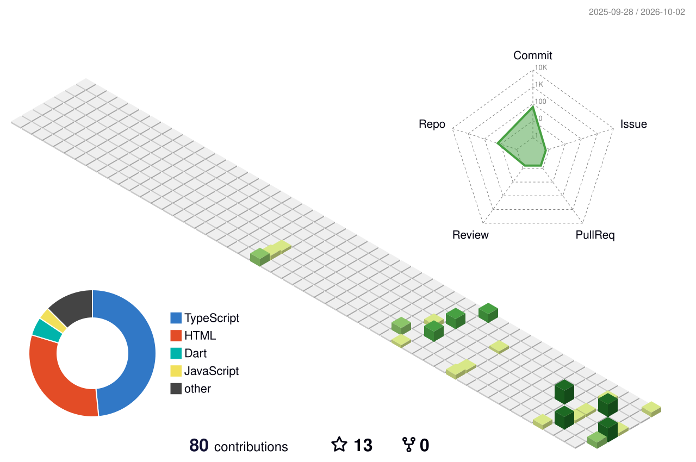

<!-- Badges -->

---

## 🧊 3D Contribution Graph

## 🐍 Snake Eating My Contributions

<picture>
  <source media="(prefers-color-scheme: dark)" srcset="https://raw.githubusercontent.com/fahim5536/fahim5536/output/github-contribution-grid-snake-dark.svg"/>
  <source media="(prefers-color-scheme: light)" srcset="https://raw.githubusercontent.com/fahim5536/fahim5536/output/github-contribution-grid-snake.svg"/>
  
</picture>

---

## 🛠️ Tech Stack (3D Icons)

  

**🔐 Focus Areas:** End-to-End Encryption • 🤖 AI-Powered Chat (Gemini) • 🛒 E-Commerce Platforms • 🎥 Real-Time Video Calling

---

## 🏆 GitHub Trophies

---

## 📌 Featured Projects

| Repository | Description | Tech |
| :--- | :--- | :--- |
| **[alokmessage](https://github.com/fahim5536/alokmessage)** | A next-generation secure messenger with AI-powered chat, 4K video calling, and global OTP authentication. | TypeScript |
| **[aam-bahar-user](https://github.com/fahim5536/aam-bahar-user)** | Aam Bahar E-commerce — a complete frontend for a fruit & vegetable online store. | TypeScript |
| **[aam-bahar-admin](https://github.com/fahim5536/aam-bahar-admin)** | Aam Bahar Admin Dashboard — full control panel for products, orders, and users. | TypeScript |
| **[pawdroplegal](https://github.com/fahim5536/pawdroplegal)** | Legal and compliance management tool (Pawdrop Legal). | HTML |
| **[pawdropstore](https://github.com/fahim5536/pawdropstore)** | Pawdrop Store — online storefront. | HTML |
| **[tutormessenger](https://github.com/fahim5536/tutormessenger)** | Messenger platform for tutors and students. | TypeScript |
| **[onekittoolkit](https://github.com/fahim5536/onekittoolkit)** | OneKit Toolkit — a handy collection of utilities and components. | HTML |

---

## 📊 GitHub Stats

### 📈 Contribution Activity Graph

---

## 📫 Connect with Me

  

---

